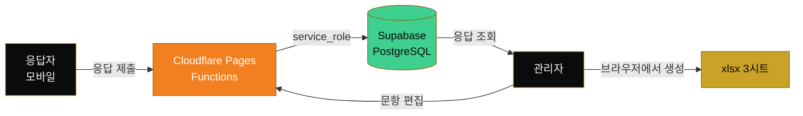

<div align="center">

**구글폼 대신 쓰려고 직접 만든 설문 플랫폼.**
블랙·화이트·골드 톤으로 디자인했고, 모바일 응답을 기준으로 설계했다.

<br/>


[](https://fki-survey.pages.dev)


</div>

---

## 왜 만들었나

교육 만족도조사를 받아야 하는데 구글폼은 두 가지가 걸렸다.

- **디자인을 우리 톤으로 못 바꾼다.** 기관 교육에 쓰기엔 인상이 가볍다.
- **응답자 대부분이 휴대폰으로 연다.** 구글폼 모바일은 손가락으로 누르기에 최적화돼 있지 않다.

그래서 모바일을 기준으로 다시 설계했다. 선택지는 전부 54px 이상 풀폭 카드고,
입력창은 16px 이상이라 iOS에서 포커스할 때 화면이 확대되지 않는다.

## 어떻게 굴러가나



브라우저에는 **Supabase 키가 일절 내려가지 않는다.** 두 테이블에 RLS를 켜되 정책을
하나도 만들지 않아서 anon 키로는 아무것도 읽지 못하고, 모든 접근은 Worker가
service_role로만 수행한다.

엑셀은 Workers에서 exceljs가 돌지 않아(Node 스트림 의존) 관리자 브라우저에서 만든다.

## 실행

```bash
node server.js
```

- 응답자 화면 : http://localhost:6767/
- 관리자 화면 : http://localhost:6767/admin

관리자 비밀번호는 `ADMIN_PASSWORD` 환경변수로 준다.

```bash
set ADMIN_PASSWORD=원하는비밀번호 && node server.js
```

주지 않으면 실행할 때마다 임시 비밀번호를 만들어 콘솔에 출력한다.
저장소에 기본 비밀번호를 박아두지 않기 위한 것이므로, 그 값을 코드나 문서에 적지 말 것.

같은 공유기에 붙은 휴대폰에서는 서버 기동 시 콘솔에 찍히는 `http://192.168.x.x:6767/` 로 접속하면 된다.

## 설문 유형

| | A형 | B형 |
|---|---|---|
| 원본 | K-Insight 아카데미 강의평가서(HWP) | 모아폼(KT) + 구글폼(대한제분) 통합 |
| 성격 | 강연 단위 평가 · 기명 | 표준 척도 평가 · 익명 |
| 평가 방식 | 100점 만점 점수 + 추천/비추천 | 5점 척도 (매우 만족~매우 불만족) |
| 기본 문항 | 강연 2 + 주관식 3 | 척도 15 + 주관식 3 |

두 유형 모두 제목·문항·보기를 회차마다 자유롭게 바꿀 수 있다.

## 문항 유형

- `척도 (5점)` — 보기 순서대로 점수가 매겨진다. **첫 번째 보기가 만점**이며, 엑셀에 원본 라벨과 환산점수가 함께 나온다.
- `객관식 (단일선택)` / `객관식 (복수선택)`
- `주관식 (단답)` / `주관식 (장문)`
- `강연평가 (점수 + 추천)` — 일자·강사명을 넣고 100점 슬라이더와 추천/비추천을 받는다. A형 전용 구조.

## 엑셀 추출

관리자 화면의 **엑셀(xlsx) 다운로드** 버튼. 파일명은 `설문명_유형_날짜.xlsx` 로 고정된다.

```
제1기K-Insight아카데미과정강의평가서_A형_20260824.xlsx
```

시트 구성:

1. **응답 원본** — 1행 1응답. 척도 문항은 라벨과 환산점수가 두 열로 나뉜다.
2. **문항별 요약** — 문항별 응답수·평균·보기별 분포. 강연평가는 평균점수와 추천율.
3. **주관식 응답** — 주관식만 모아 읽기 좋게 정리.

## 로고 교체

푸터는 기본적으로 활자 로고(FKI / 한경협국제경영원 / 인재교육사업실)로 표시된다.
`public/assets/logo.png` 에 실제 로고 파일을 넣으면 자동으로 이미지가 대신 표시된다.
어두운 배경이므로 흰색 또는 골드 버전 PNG(투명 배경) 권장, 높이 100px 내외면 충분하다.

## 데이터

- `data/surveys.json` — 설문 정의
- `data/responses.json` — 응답 원본

두 파일만 백업하면 전체가 보존된다. 응답은 제출 즉시 파일에 기록된다.

서버 인스턴스는 하나만 띄울 것. 같은 `data/` 를 보는 프로세스를 둘 이상 돌리면
각자 메모리 캐시를 들고 있어 나중에 쓴 쪽이 상대의 응답을 덮어쓴다.
(배포판은 Postgres를 쓰므로 이 제약이 없다.)

## 클라우드 배포

`cloud/` 디렉터리에 Cloudflare Pages + Supabase 배포판이 들어 있다.
절차는 [cloud/DEPLOY.md](cloud/DEPLOY.md) 참고.

## 배포 시 체크리스트

- [ ] `ADMIN_PASSWORD` 환경변수 변경
- [ ] HTTPS 적용 (리버스 프록시 권장)
- [ ] `data/` 디렉터리 정기 백업
- [ ] A형처럼 이름을 받는 설문은 개인정보 수집·이용 동의 문구를 안내문에 추가

---

<div align="center">
<sub>인턴 때 실제 교육 만족도조사를 받으며 만들었고, 지금도 굴러가고 있습니다.</sub>
</div>


